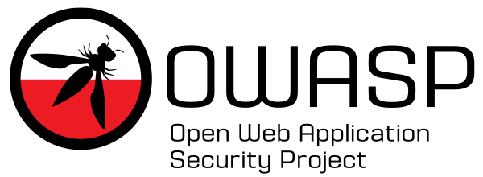

<!-- tags: This is a space-delimited list of tags you associate with your project or chapter.  If you are using tabs, at least one of these tags should be unique in order to be used in the tabs files (an example tab is included in this repo) -->

## Welcome

Witamy wszystkich bardzo serdecznie na stronie polskiej grupy OWASP. Obecnie prowadzimy działania w regionach wymienionych poniej.

You are welcome on the Polish OWASP Chapter website!
We currently act in following regions:

* Warszawa
* Kraków
* Poznań
* Wrocław
* Śląsk
* Trójmiasto

## Who are we

The original Polish Chapter was founded in June 2007 by Andrzej Targosz and Robert Pająk.
Current chapter leader is [Daniel Krasnokucki](mailto:daniel.krasnokucki@owasp.org).

## Check our Upcoming Meetup Events


## Continuous CfP
Zapraszamy do ciągłego zgłaszania się do kolej nych MeetUpów - na razie on-line, ale po zniesieniu obostrzeń wracamy do normalnych spotkań. 

Please fill CfP whenever you want to share your research!

[Call for Papers - OWASP Poland MeetUp](https://forms.gle/F33n4PMqMdUFDR1z5)

